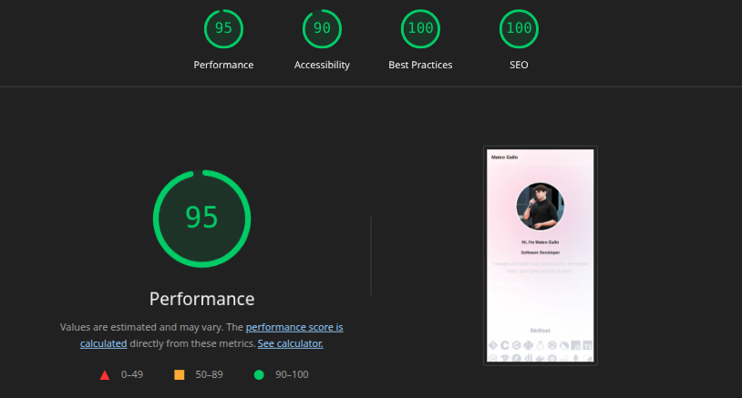

# Portfolio

<p align="center">
  
</p>

## Getting Started

First, run the development server:

```bash
npm run dev
# or
yarn dev
# or
pnpm dev
# or
bun dev
```

Open [http://localhost:3000](http://localhost:3000) with your browser to see the result.


## Production-like run
Use the following commands to build the website and serve it, as production deployment does:

```bash
npm run build
npx serve out
```

## Benchmark
Run `run_lh.sh` script to check out the site performance, accessibility, practices, and SEO optimizations.

First run the website locally production-like on port `3000`. Then run the script:
```bash
./run_lh.sh
```
